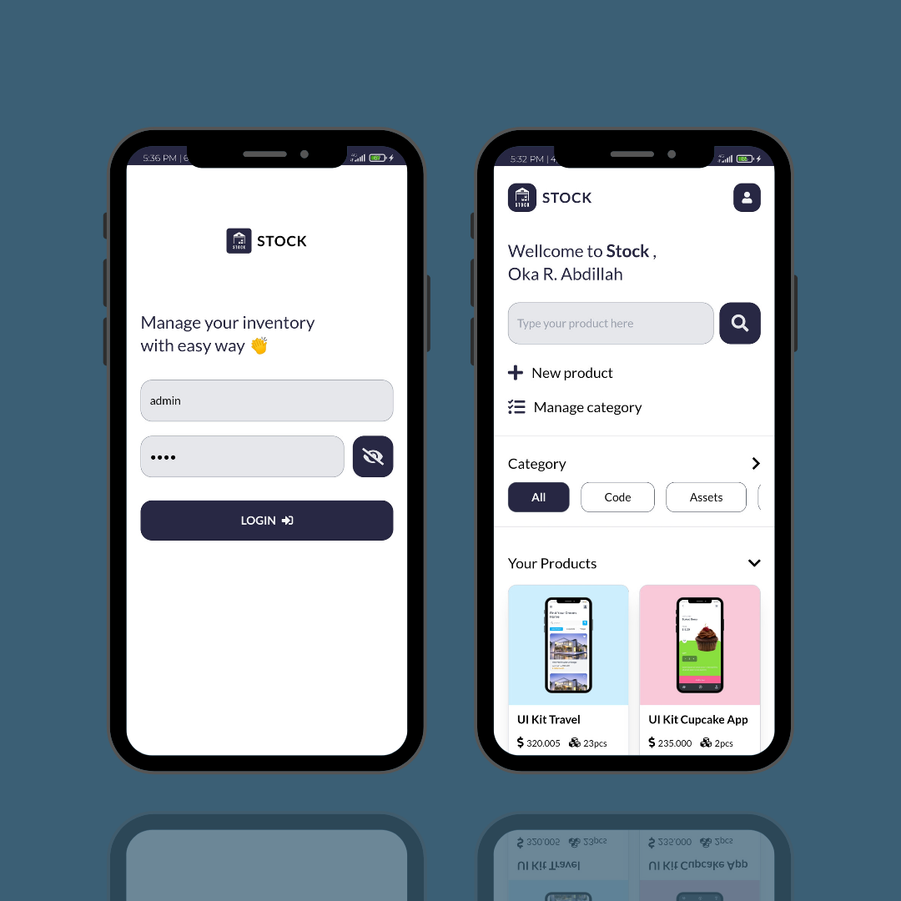
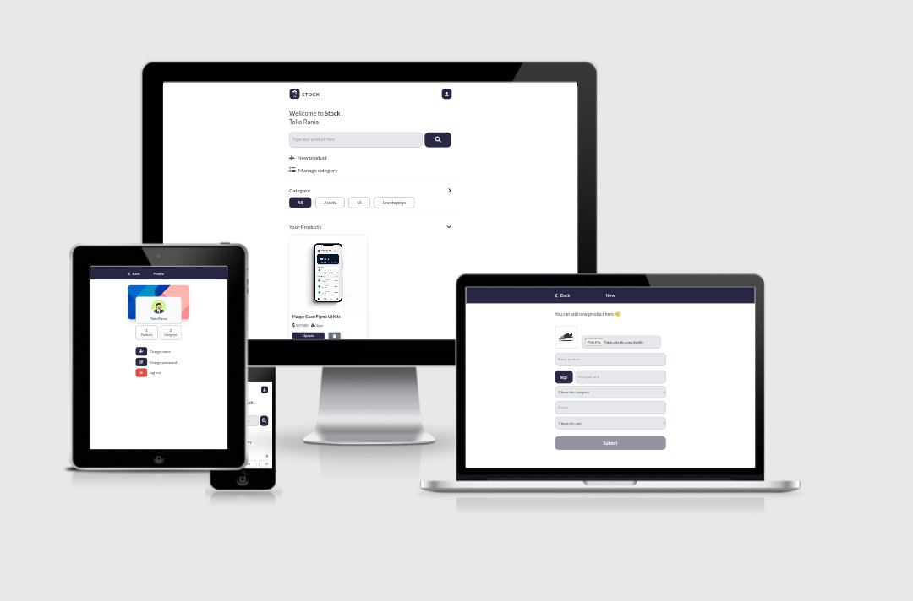

<h3 align="center">Stock APP</h3>

Manage Your Inventory With Easy Way

<!-- social media connecting shield -->

[![Instagram][instagram-shield]][instagram-url]
[![Twitter][twitter-shield]][twitter-url]
[![LinkedIn][linkedin-shield]][linkedin-url]
[![Github][github-shield]][github-url]

<!-- my social media links -->

[instagram-url]: https://www.instagram.com/dynastyelvis/
[twitter-url]: https://twitter.com/Dev_Rono
[linkedin-url]: https://www.linkedin.com/in/kipkemoi-elvis-aa3548209
[github-url]: https://github.com/DynastyElvis

<!-- shield icon links -->

[instagram-shield]: https://img.shields.io/badge/-Instagram-black.svg?style=flat-square&logo=instagram&color=555&logoColor=white
[twitter-shield]: https://img.shields.io/badge/-Twitter-black.svg?style=flat-square&logo=twitter&color=555&logoColor=white
[linkedin-shield]: https://img.shields.io/badge/-LinkedIn-black.svg?style=flat-square&logo=linkedin&colorB=555
[github-shield]: https://img.shields.io/badge/-Github-black.svg?style=flat-square&logo=github&color=555&logoColor=white

📌 Client Application / Front End

[More screenshoots](http://www.instagram.com/p/CVIPq2JlX2B/?utm_medium=copy_link)

### About
Stock App, is a website-based inventory management application built with Vue JS, Node JS, and MySql.
 
This application can assist users in managing their inventory in an easy and organized way with a categorization system and product search.

### Responsive Test

- Test Via [A'm I Responsive](http://ami.responsivedesign.is)

### Languages and Tools
- Vue JS 3
- Tailwindcss
- VUEX
- Vue Router
- Font Awesome 5
- Google Fonts
- Vite Js
- Termux
- Acode code editor
- Git
- Canva for wireframe and mockup

### Features
- Create new product
- Update product
- Remove product
- Upload image to server
- Remove image from server
- Create category
- Rename category
- Create new category
- Remove category
- Product search by keyword
- Product search by category
- Change name 
- Change password
- Login with username and password
- Minimalist design UI

### Demo 
- [Demo Stock App - Inventory Management](http://www.instagram.com/reel/CVMyBH1FOdB/?utm_medium=copy_link)

### How To Start
- Clone this repository with this command <code>git clone https://github.com/or-abdillh/stock-app.git</code>
- Then, use this command <code>cd stock-app</code>
- Install all dependencies <code>npm install</code>
- Finally run the server <code>npm run dev</code>
- The local server running at http://localhost:3000/
- By default username = admin and password = hans4x

### Thanks 
<!-- social media connecting shield -->
KIPKEMOI ELVIS 
[![Instagram][instagram-shield]][instagram-url]
[![Twitter][twitter-shield]][twitter-url]
[![LinkedIn][linkedin-shield]][linkedin-url]
[![Github][github-shield]][github-url]

<!-- my social media links -->

[instagram-url]: https://www.instagram.com/dynastyelvis/
[twitter-url]: https://twitter.com/Dev_Rono
[linkedin-url]: https://www.linkedin.com/in/kipkemoi-elvis-aa3548209
[github-url]: https://github.com/DynastyElvis

<!-- shield icon links -->

[instagram-shield]: https://img.shields.io/badge/-Instagram-black.svg?style=flat-square&logo=instagram&color=555&logoColor=white
[twitter-shield]: https://img.shields.io/badge/-Twitter-black.svg?style=flat-square&logo=twitter&color=555&logoColor=white
[linkedin-shield]: https://img.shields.io/badge/-LinkedIn-black.svg?style=flat-square&logo=linkedin&colorB=555
[github-shield]: https://img.shields.io/badge/-Github-black.svg?style=flat-square&logo=github&color=555&logoColor=white

